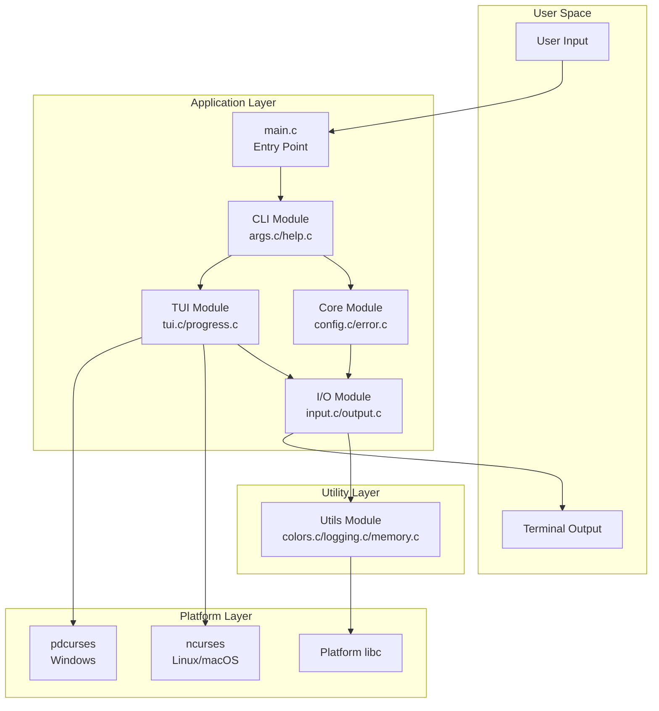
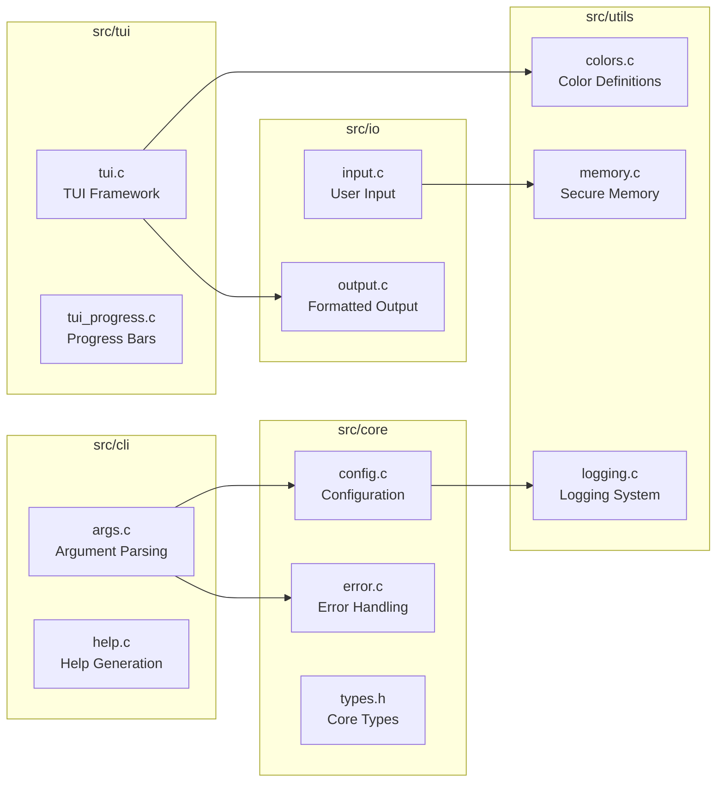
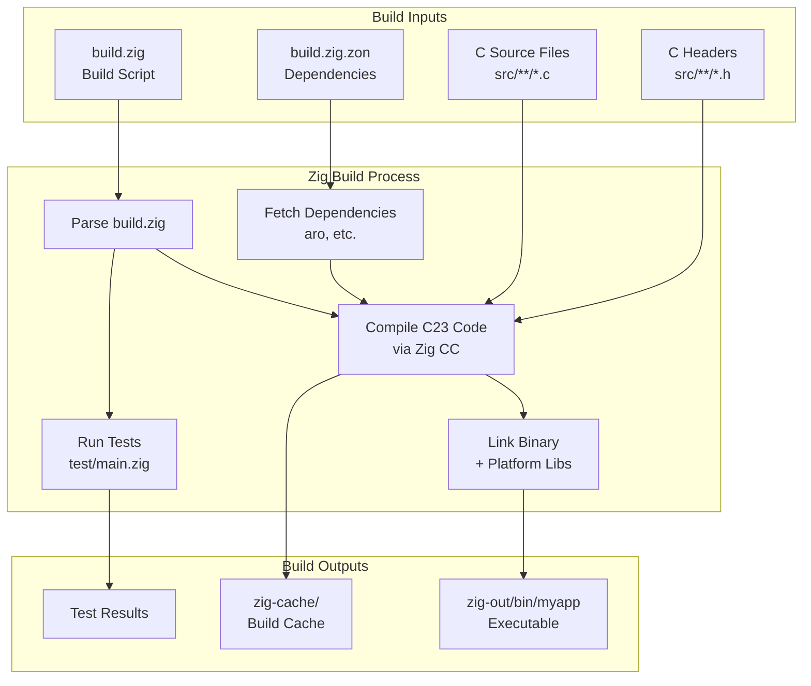
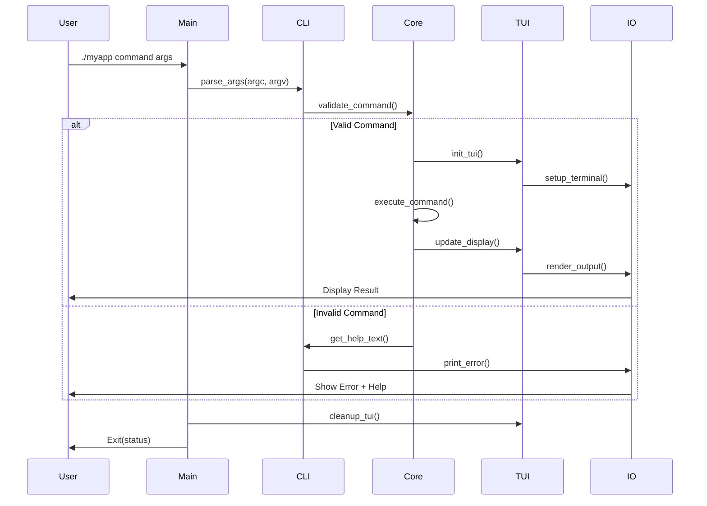
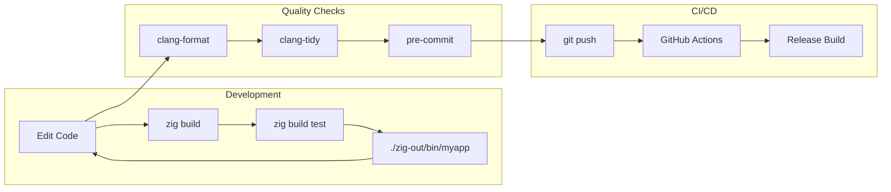

# Architecture Overview

This document provides a comprehensive overview of the C23 CLI Template architecture, designed to help new contributors understand the codebase structure and build system.

## Table of Contents

- [High-Level Architecture](#high-level-architecture)
- [Module Structure](#module-structure)
- [Build System](#build-system)
- [Data Flow](#data-flow)
- [Platform Abstraction](#platform-abstraction)
- [Security Architecture](#security-architecture)

## High-Level Architecture



## Module Structure

### Core Modules



### Module Responsibilities

| Module | Purpose | Key Functions |
|--------|---------|---------------|
| **cli** | Command-line argument parsing and help generation | `parse_args()`, `print_help()` |
| **core** | Core application logic and configuration | `load_config()`, `handle_error()` |
| **io** | Input/output operations with formatting | `read_input()`, `write_output()` |
| **tui** | Terminal UI components and rendering | `init_tui()`, `show_progress()` |
| **utils** | Cross-cutting utilities and helpers | `secure_malloc()`, `log_message()` |

## Build System

### Zig Build Pipeline



### Build Commands

```bash
# Development build
zig build

# Run tests
zig build test

# Release build
zig build -Doptimize=ReleaseSafe

# Install to prefix
zig build install --prefix ~/.local

# Check without building
zig build check
```

## Data Flow

### Command Processing Flow



## Platform Abstraction

### Cross-Platform Strategy

```mermaid
graph TD
    subgraph "Application Code"
        APP[Platform-Agnostic Code]
    end
    
    subgraph "Abstraction Layer"
        ABS[Platform Abstractions<br/>#ifdef guards]
    end
    
    subgraph "Linux/macOS"
        UNIX[POSIX APIs]
        NC[ncurses]
        MLOCK[mlock()]
    end
    
    subgraph "Windows"
        WIN[Win32 APIs]
        PDC[pdcurses]
        VLOCK[VirtualLock()]
    end
    
    APP --> ABS
    ABS -->|__linux__ or __APPLE__| UNIX
    ABS -->|_WIN32| WIN
    UNIX --> NC
    WIN --> PDC
    UNIX --> MLOCK
    WIN --> VLOCK
```

### Platform-Specific Features

| Feature | Linux/macOS | Windows |
|---------|-------------|---------|
| **Terminal UI** | ncurses | pdcurses |
| **Secure Memory** | mlock/munlock | VirtualLock/VirtualUnlock |
| **Config Path** | ~/.config/myapp/ | %APPDATA%\myapp\ |
| **Path Separator** | / | \ |
| **Binary Extension** | (none) | .exe |

## Security Architecture

### Security Layers

```mermaid
graph TB
    subgraph "Input Validation"
        ARGVAL[Argument Validation]
        INPUTSAN[Input Sanitization]
        BUFCHECK[Buffer Overflow Protection]
    end
    
    subgraph "Memory Security"
        SECMEM[Secure Allocation<br/>mlock/VirtualLock]
        ZEROMEM[Zero on Free<br/>secure_zero()]
        CANARY[Stack Canaries<br/>-fstack-protector]
    end
    
    subgraph "Build Security"
        RELRO[RELRO<br/>Read-Only Relocations]
        NX[NX/DEP<br/>No-Execute]
        PIE[PIE/ASLR<br/>Position Independent]
    end
    
    ARGVAL --> SECMEM
    INPUTSAN --> SECMEM
    BUFCHECK --> ZEROMEM
    SECMEM --> RELRO
    ZEROMEM --> NX
    CANARY --> PIE
```

### Security Features

1. **Input Validation**
   - All command-line arguments are validated
   - Buffer sizes are checked before operations
   - String operations use safe variants

2. **Memory Protection**
   - Sensitive data locked in memory (where supported)
   - Memory zeroed before deallocation
   - Stack protection enabled by default

3. **Build Hardening**
   - Position-independent executables (PIE)
   - Stack canaries enabled
   - Fortify source macros used

## Development Workflow

### Typical Development Cycle



## Next Steps

- See [CONTRIBUTING.md](../CONTRIBUTING.md) for detailed build instructions
- Check [examples/](../examples/) for usage examples
- Review [build.zig](../build.zig) for build configuration details