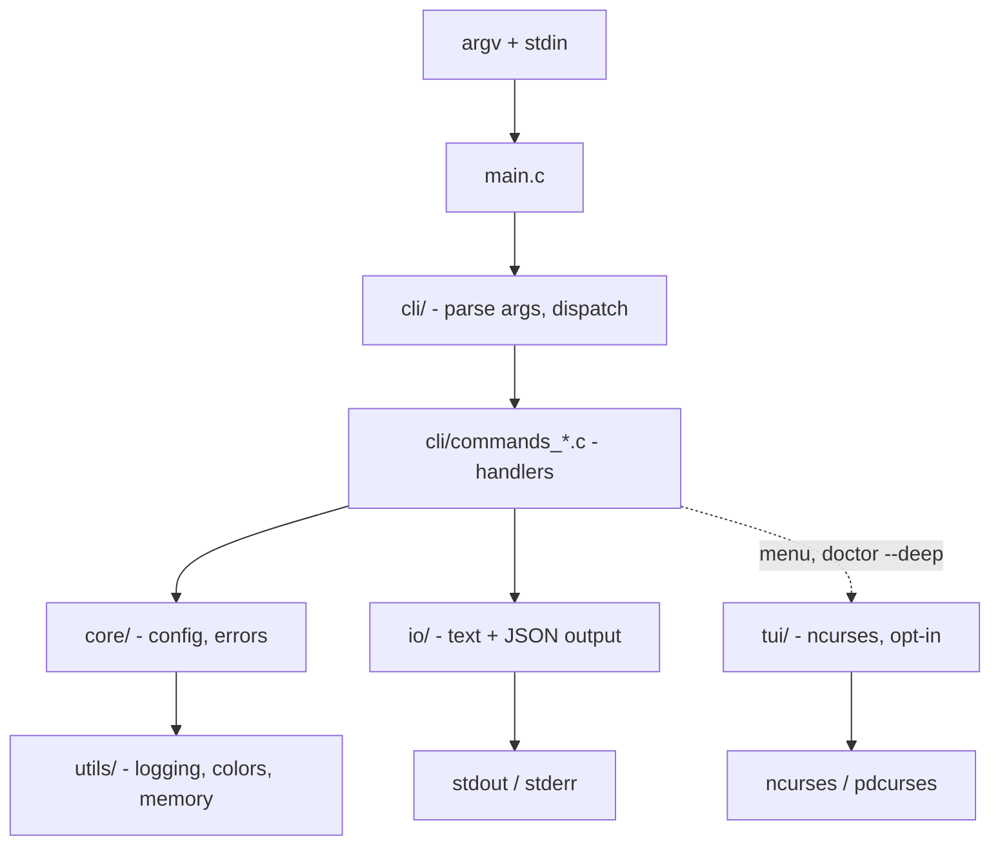

# Architecture Overview

A map of how a project generated from this template is put together: the layers, the real modules, how a command runs, and where to add your own code.

- [The mental model](#the-mental-model)
- [Module map](#module-map)
- [Request lifecycle](#request-lifecycle)
- [Build system](#build-system)
- [Platform differences](#platform-differences)
- [Security model](#security-model)
- [Where to add code](#where-to-add-code)

## The mental model

It is a small, layered C23 program. `main.c` parses arguments, resolves configuration,
looks up a command in a table, and runs its handler. Handlers write text (or JSON with
`--json`) through one I/O layer and signal failure with a typed error code that becomes
the process exit status.

The interactive ncurses interface is a separate layer that only compiles when you pass `-Denable-tui=true`. The default build is a plain libc CLI with no curses dependency.

```mermaid
graph TD
    USER[argv + stdin] --> MAIN[main.c]
    MAIN --> CLI["cli/ - parse args, dispatch"]
    CLI --> CMD["cli/commands_*.c - handlers"]
    CMD --> CORE["core/ - config, errors"]
    CMD --> IO["io/ - text + JSON output"]
    CMD -. "menu, doctor --deep" .-> TUI["tui/ - ncurses, opt-in"]
    CORE --> UTILS["utils/ - logging, colors, memory"]
    IO --> TERM[stdout / stderr]
    TUI --> CURSES[ncurses / pdcurses]
```

## Module map

Each directory under `src/` owns one concern. The functions below are representative entry points, not the full surface; read the matching header for the rest.

| Module | Files | Responsibility | Representative functions |
| --- | --- | --- | --- |
| `cli` | `args.c`, `help.c`, `commands.c`, `commands_*.c`, `opencli_contract.c` | Parse argv, apply global flags, find and dispatch commands, render help, expose the OpenCLI contract | `app_args_handle_immediate_exit()`, `app_commands()`, `app_command_find()`, `app_print_concise_help()` |
| `core` | `config.c`, `config_json.c`, `error.c`, `types.h` | Layered configuration, the flag table, and typed errors | `app_config_create()`, `app_config_load_env()`, `app_config_get_flag()`, `app_strerror()` |
| `io` | `input.c`, `output.c` | Read stdin/files; write human text and versioned JSON | `app_read_input_from_stdin()`, `app_output()`, `app_json_write_string()` |
| `tui` | `tui.c`, `tui_menu.c`, `tui_menu_model.c`, `tui_progress.c`, `tui_app.c` | ncurses lifecycle, modal menus, progress bars, and the demo showcase (compiled only with `-Denable-tui=true`) | `tui_init()`, `tui_cleanup()`, `tui_show_menu()`, `tui_progress_create()` |
| `utils` | `colors.c`, `logging.c`, `memory.c` | Cross-cutting helpers: color setup, leveled logging, secret zeroing | `app_log_init()`, `app_secret_zero()` |

The command table is the seam to extend. `commands.c` registers the built-in commands,
and each lives in its own file (`commands_basic.c` for `hello`/`echo`, plus
`commands_info.c`, `commands_doctor.c`, `commands_menu.c`, `commands_opencli.c`). See
[examples/adding-a-command.md](../examples/adding-a-command.md).

## Request lifecycle

1. `main()` initializes logging and creates an `app_config_t`.
2. The CLI layer reads argv. Immediate-exit options (`--help`, `--version`) are handled
   first by `app_args_handle_immediate_exit()`. Global flags (`--debug`, `--quiet`,
   `--verbose`, `--json`, `--plain`, `--no-color`, `--config`) update the config; the
   remaining tokens become the command name and its arguments.
3. Configuration is resolved by precedence: **CLI args > environment > config file > defaults**.
4. `app_command_find()` looks up the command. Its handler runs and writes output through `app_output()` / the `app_json_*` helpers.
5. On failure a handler returns an `app_error` value (see `core/error.c`). `app_strerror()` describes it, and the numeric code becomes the exit status. The public codes are listed in `opencli.json`.
6. Commands that need the terminal UI (`menu`, and `doctor --deep`) call `tui_init()` and always pair it with `tui_cleanup()`, including on interrupt.

The stable shape of this surface (commands, flags, exit codes, JSON envelopes) is documented in [CONTRACTS.md](CONTRACTS.md).

## Build system

`build.zig` compiles the C sources with Zig's bundled Clang. The base binary is the
file list in the `base_sources` array; the `tui_sources` are appended only when
`-Denable-tui=true`, which also defines `ENABLE_TUI=1` and links `ncursesw` (or
`pdcurses` on Windows). A separate `tui-menu-lib` step builds the reusable menu
primitive as a static library with installed headers.

For the build options, steps, and how to add a source file, see the [Zig Primer](ZIG_PRIMER.md).

## Platform differences

| Concern | Linux / macOS | Windows |
| --- | --- | --- |
| Terminal UI | ncurses (`ncursesw`) | pdcurses |
| Secret memory | zero + lock out of swap where supported | zero + `VirtualLock` where supported |
| Config path | `~/.config/myapp/config.json` | `%USERPROFILE%\AppData\Local\myapp\config.json` |
| Binary name | `myapp` | `myapp.exe` |

Cross-compilation is a `-Dtarget=` flag away because Zig ships every target's headers and libc; no second toolchain to install.

## Security model

The template's defenses are the ones actually wired into the code and CI, not compiler hardening flags. Those are left for you to opt into.

- **Memory hygiene.** Sensitive buffers are overwritten with `app_secret_zero()` before they are freed, and the input path locks them out of swap where the platform supports it (`mlock` / `VirtualLock`).
- **Runtime safety.** The default and `ReleaseSafe` builds keep Zig's runtime safety checks. C sources compile with `-Wall -Wextra -std=c23`.
- **Static analysis in CI.** GitHub Actions runs `clang-tidy` and `cppcheck` over the C sources on every change.
- **Supply chain in CI.** Gitleaks secret scanning, an OpenSSF Scorecard run, SBOM generation, and pinned action versions.

Compiler-level hardening (`-fstack-protector-strong`, `-D_FORTIFY_SOURCE=2`, PIE/RELRO) is **not** enabled by default. If your threat model needs it, add the flags to `base_flags` in `build.zig`.

## Where to add code

| You want to… | Start here |
| --- | --- |
| Add a command | [examples/adding-a-command.md](../examples/adding-a-command.md), then register it in `src/cli/commands.c` |
| Add a config flag | `src/core/config.c` (the flag table) and `src/core/config_json.c` |
| Add a new exit code | `src/core/error.c`, then regenerate `opencli.json` (see [CONTRACTS.md](CONTRACTS.md)) |
| Build a TUI screen | [examples/custom-tui.md](../examples/custom-tui.md) and `src/tui/` |
| Add a source file to the build | the `base_sources` array in `build.zig` (see [ZIG_PRIMER.md](ZIG_PRIMER.md)) |
| Test any of the above | [TESTING.md](TESTING.md) |
